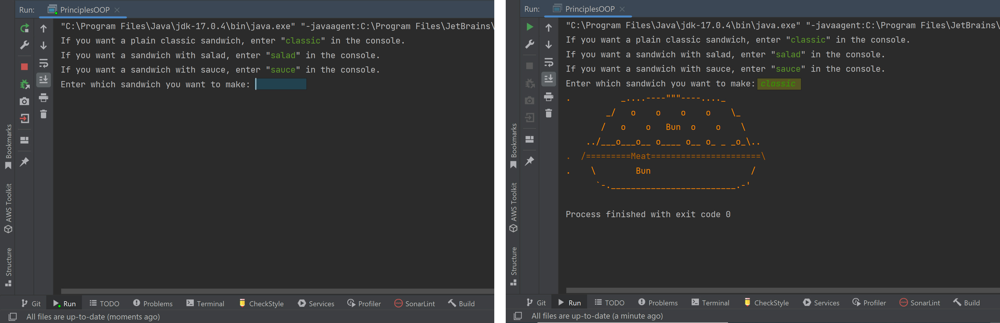

<h1>OOP-principles</h1>

 <h2>Description of the Application</h2>
  
This application is a Java program designed for practical demonstration of the fundamental principles of 
Object-Oriented Programming (OOP) by creating and displaying ASCII art objects in the console.

  
The program's logic is based on creating a parent object called "Sandwich" and overriding this object 
depending on the type chosen by the user. The user can select the object type from the provided values: 
"classic," "salad," or "sauce" by entering the corresponding value in the console.

  
The following OOP principles are implemented in this program:

  <ul>
   <li>

<b>Inheritance:</b> This is represented by the properties of the classes "SandwichWithSalad" 
and "SandwichWithSauce," which use methods such as "readProperty(property), getOrangeColor(), getBrownColor(), 
getResetColor()" from the parent class "Sandwich."

</li>

<li>

<b>Polymorphism:</b> It indicates that an object behaves differently in different situations. In this case, 
it is achieved by overriding the method "prepareAndPrintSandwich()" in the child classes "SandwichWithSalad" 
and "SandwichWithSauce." An example of polymorphism is the reassignment of a variable reference to an object 
of the parent class in the main class "PrinciplesOOP." The variable "sandwich," which is a reference to an object 
of the "Sandwich" class, is assigned a new object of the child classes, either "sandwich = new SandwichWithSalad()" 
or "sandwich = new SandwichWithSauce()".

</li>

<li>

<b>Encapsulation:</b> It restricts access to class fields and methods using access modifiers like "private," 
"protected," and "public." Access to class fields is provided through get() and set() methods.

</li>

<li>

<b>Abstraction:</b> It involves hiding internal details and describing functions with simple names. 
The principle of abstraction can be achieved through inheritance and encapsulation. In this program, an example 
of abstraction is the use of the "readProperty(property)" method from the parent class "Sandwich" in the child 
class "SandwichWithSalad."

Other OOP principles such as "association," "aggregation," and "composition" are not illustrated in this example.

</li>

<li>

<b>Association:</b> Achieved by having objects of one class in the fields of another class.

</li>

<li>

<b>Aggregation:</b> Achieved by having objects of one class in the fields of another class, with the object 
of the second class passed through the constructor when creating an object of the first class.

</li>

<li>

<b>Composition:</b> Achieved by having objects of one class in the fields of another class, where the object 
of the second class is created in the constructor of the first class. In other words, the object of the second 
class cannot exist without the first class.

</li>

</ul>

<h2>Screenshots of the application console</h2>

 
 
 

 <h2>Technologies Used</h2>

<ul>
<li>Java</li>
<li>OOP</li>
</ul>

